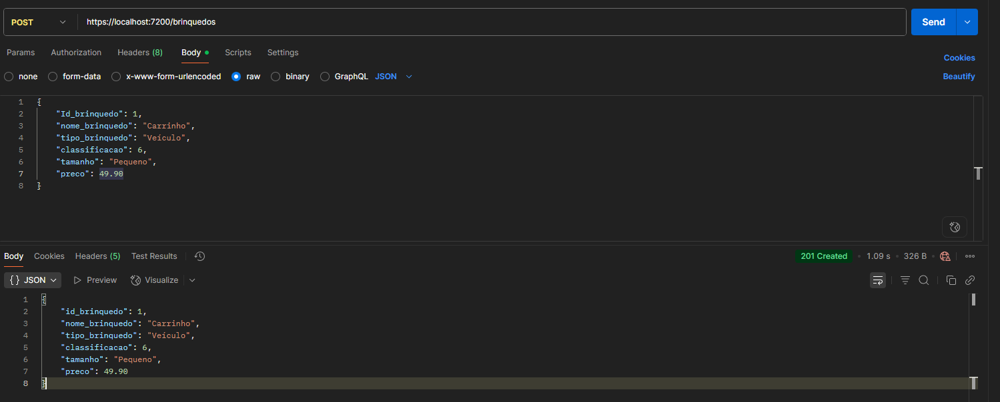

# ToyShop 🧸

## Integrantes
- Gabriel Santos Jablonski, rm:555452
- Gustavo Lopes Santos da Silva, rm:556859
- Renato de Freitas David Campiteli, rm:555627

## Descrição

ToyShop é uma API desenvolvida em C# com .NET e Entity Framework Core para gerenciar brinquedos de uma empresa voltada para crianças até 14 anos. O projeto utiliza banco de dados relacional (Oracle SQL Developer) e contempla todas as operações CRUD (Create, Read, Update, Delete) via endpoints HTTP, testados com Swagger e Postman.

A tabela utilizada no banco de dados é `TDS_TB_Brinquedos`, com as seguintes colunas:
- `Id_brinquedo`
- `Nome_brinquedo`
- `Tipo_brinquedo`
- `Classificacao`
- `Tamanho`
- `Preco`

## Tecnologias Utilizadas

- C# (.NET 8)
- Entity Framework Core
- Banco de Dados Relacional (Oracle)
- Swagger
- Postman

## Como Executar

1. Clone o repositório:
	 ```bash
	 git clone https://github.com/GuLopes14/ToyShop.git
	 ```
2. Configure a string de conexão no arquivo `appsettings.json`.
3. Execute as migrações do Entity Framework Core para criar a tabela no banco de dados.
4. Inicie o projeto:
	 ```bash
	 dotnet run
	 ```
5. Acesse o Swagger em: `http://localhost:5000/swagger` (ou porta configurada).

## Endpoints

### 1. GET /brinquedos

Retorna todos os brinquedos cadastrados.

**Exemplo de resposta:**
```json
[]
```

### 2. POST /brinquedos

Cadastra um novo brinquedo.

**Exemplo de JSON para cadastro no Postman:**
```json
{
    "Id_brinquedo": 1,
	"nome_brinquedo": "Boneca",
	"tipo_brinquedo": "Boneca",
	"classificacao": 5,
	"tamanho": "Médio",
	"preco": 79.90
}
```

### 3. PUT /brinquedos/{id}

Atualiza um brinquedo existente.

**Exemplo de JSON para atualização no Postman:**
```json
{
	"Id_brinquedo": 1,
	"nome_brinquedo": "Boneca Super",
	"tipo_brinquedo": "Boneca",
	"classificacao": 6,
	"tamanho": "Grande",
	"preco": 99.90
}
```

### 4. DELETE /brinquedos/{id}

Remove um brinquedo do sistema.

**Exemplo de requisição no Postman:**
- Método: DELETE
- URL: `http://localhost:7200/brinquedos/1`

## Testes com Swagger e Postman

- Todos os endpoints podem ser testados diretamente pelo Swagger.
- Para testar no Postman, utilize os exemplos de JSON acima.

	
	
	
	
	

## Observações

- O projeto utiliza o padrão REST.
- As operações de POST e PUT enviam dados para uma lista interna antes de persistir no banco de dados.
- Certifique-se de que o banco de dados está rodando e acessível.
